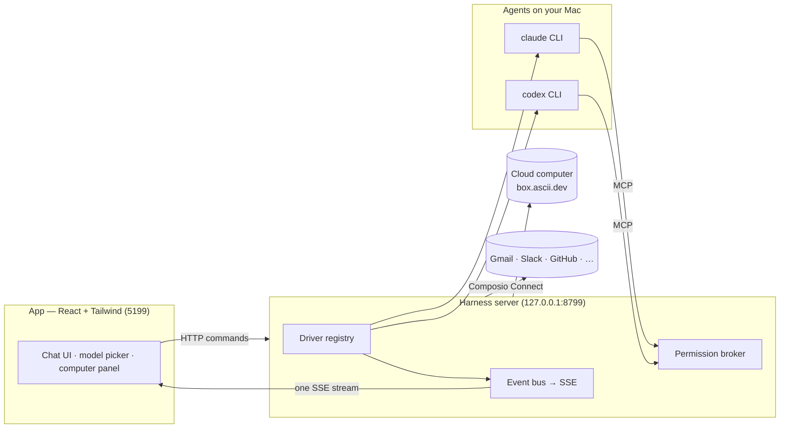

> ⚠️ **No affiliation with any cryptocurrency.** OpenMausBot has no token. Any coin using the OpenMausBot, Maus, or SupaMaus name is not created, endorsed, or affiliated with this project or its maintainer. I have received no tokens, payment, or allocation from anyone, and I will not be endorsing any token.

<div align="center">

# OpenMausBot

**Your own team of AI bots, in a chat app.**

<sub>An open-source version of **Grok Bot** — bring-your-own-agent, local-first, on the models you already have.</sub>

Every bot in the sidebar is a real agent — Claude or Codex running locally under the hood — with its own
personality, its own model, its own cloud computer, and its own connected apps.
Talk to them like contacts. Watch them work. Approve what matters.


<br>

<a href="https://github.com/milind-soni/openmausbot-releases/releases/latest/download/OpenMausBot.dmg">
  
</a>

<sub>Apple silicon · signed & notarized · one-click .dmg, always the latest · [all releases](https://github.com/milind-soni/openmausbot-releases/releases)</sub>

<br>
<br>


</div>

---

## Why

One assistant in one box is the wrong shape for agents. OpenMausBot is an open-source take on **Grok Bot** —
it keeps the idea (AI as a *messaging app*: a roster of bots you chat with, each with its own personality,
memory of its thread, model, computer, and apps) and rebuilds it open, local-first, and on the agents you
already have:

- **Bring your own agents.** Bots run on the `claude`, `codex`, `grok`, `gemini`, and `kimi` CLIs installed on your Mac — your
  existing logins and subscriptions, no new accounts, no proxy in the middle.
- **Local first.** One small harness server on `127.0.0.1` owns every agent process. Transcripts, settings,
  and events live in `~/.openmausbot`; packaged macOS builds keep provider secrets in Apple Keychain.
- **Agents with hands.** Each bot can get a real computer — a cloud Linux desktop it drives while you watch
  live, or your own Mac — plus 500+ apps through Composio Connect.

## Features

<table>
<tr>
<td width="50%" valign="top">

### 🧠 Pick a brain per bot

A model picker with a provider rail — Claude and Codex models side by side, defaults marked, unavailable
providers dimmed with the reason. Switch a bot's model mid-conversation.


</td>
<td width="50%" valign="top">

### 🖥️ Every bot gets a computer

Open the Computer panel and the bot's cloud desktop spins up on its own — live screen preview while it
works, "Open desktop" to take over in your browser, or point the bot at *this Mac* instead.


</td>
</tr>
<tr>
<td width="50%" valign="top">

### 🙋 Bots ask before they act

Shell commands, file edits, and questions surface as inline cards — Allow / Deny / answer in chat. A
permission broker turns every risky action into a decision you make, for cloud and local computers alike.


</td>
<td width="50%" valign="top">

### 🔌 Connected apps

A one-click marketplace over Composio Connect: Gmail, Slack, GitHub, Notion, Linear and hundreds more.
OAuth once, and every bot can use them as tools.


</td>
</tr>
<tr>
<td width="50%" valign="top">

### 🗂 Manage bots like chats

Right-click any bot: pin, mark unread, edit profile, duplicate, copy conversation ID, hide, delete. It's a
messaging app — your agents behave like contacts.


</td>
<td width="50%" valign="top">

### 🔑 Keys once, everything lights up

Paste credentials in App Settings — they persist locally and the provider fleet hot-reloads instantly.
Secrets are write-only: the UI only ever sees "configured" flags.


</td>
</tr>
</table>

**Also in the box:** per-bot embedded browser sessions with agent navigation, accessibility snapshots,
ref-based clicking, typing, and screenshots · streaming replies with tool-run activity chips · native macOS dictation from the
composer mic (on-device Apple speech recognition — desktop app) · SupaMaus cursor mascots with role-aware
expressions · screenshots of the bot's work folded into the transcript.

### Autonomous work

- **Durable Work inbox.** Every chat, routine, and team assignment has a persisted task/run record with real
  completion state, output, tool activity, token usage, retries, and a central approval queue.
- **Teams.** Select up to eight bots for one assignment. They work in parallel with separate visible threads,
  durable runs, and audit trails so each contribution can be reviewed independently.
- **Memory.** Save bot-scoped or shared facts, preferences, projects, and procedures. Memory is explicitly user-managed;
  bots do not silently write it.
- **Teach a task.** Record an embedded-browser workflow, redact entered values, review the generated procedure, and save
  it as a paused routine.
- **Routines and triggers.** Once, hourly, daily, weekdays, weekly, monthly, or yearly schedules use explicit timezones;
  webhook/email-style triggers, run history, completion notifications, and bounded retries are included.
- **Attachments.** Add approved document, image, audio, data, and source formats through a private local vault with opaque IDs
  and a 20 MB per-file limit.
- **Remote foundations.** Optional bearer-token remote API access, a compact mobile bootstrap endpoint, and Docker/systemd
  worker definitions are included. The harness remains loopback-only and accepts remote requests exclusively through an explicitly trusted HTTPS reverse proxy.
- **Mission Control and Trust Center.** Server-enforced Observe, Draft, Approve, and Auto modes; scoped temporary permission rules;
  emergency stop; provider health and failover; usage, failure, checkpoint, and approval reporting; setup certification; and workflow replay data.
- **Commercial data foundations.** Provider secrets migrate to macOS Keychain, encrypted workspace backup/import excludes credentials,
  privacy telemetry is off by default, redacted diagnostics are user-controlled, and local crash metadata is opt-in.
- **Professional starting points.** Executive Office, Research Lab, Marketing Studio, and Development Team templates install as projects
  with specialized bots and paused routines. Project knowledge sources carry provenance and freshness timestamps into every turn.

## How it works

Two processes. The app holds no transports of its own — it sends typed commands over HTTP and folds one SSE
event stream into state. The harness server owns every agent process and normalizes each provider's native
protocol into one canonical runtime event stream (logged per-thread as NDJSON).



| Layer | Where | What it does |
|---|---|---|
| Drivers | `server/drivers/` | One per provider: Claude, Codex, and Grok Build over their local CLIs (stream-JSON / JSON-RPC / ACP), plus a cloud-computer agent. Unknown drivers degrade to "unavailable", never crash the fleet. |
| Harness | `server/harness/` | Registry (configs → live instances) and the fan-in event bus every client folds. |
| API | `server/index.ts` | Bots, turns, approvals, model catalog, computer lifecycle, connectors, config — HTTP + SSE. |
| App | `src/` | The chat shell. Server-backed store, one reducer, zero client-side transports. |
| Desktop | `electron/` | macOS shell: dictation helper (SFSpeechRecognizer), local screen capture, CUA bridge. |

## Documentation

| Guide | Contents |
|---|---|
| [Complete feature guide](docs/FEATURES.md) | Product surfaces, providers, automation, computer/browser control, security, storage, limits, and current boundaries. |
| [Remote access](docs/remote-access.md) | Required HTTPS reverse-proxy topology, bearer-token setup, and deployment examples. |
| [Computer-use integration](docs/computer-use-integration.md) | macOS CUA architecture, signing/TCC ownership, embedded browser tiers, and packaging notes. |
| [Security policy](SECURITY.md) | Supported security boundaries and private vulnerability-reporting instructions. |
| [Contributing](CONTRIBUTING.md) | Development setup, architecture map, testing rules, provider SPI, and release verification. |

## Quick start

**Easiest:** [download the latest .dmg](https://github.com/milind-soni/openmausbot-releases/releases/latest),
drag it to Applications, open it. The harness server is embedded — no setup.

**From source:**

```sh
git clone https://github.com/milind-soni/OpenMausBot && cd OpenMausBot
pnpm install

pnpm dev:server    # harness server → 127.0.0.1:8799
pnpm dev           # app → http://127.0.0.1:5199
pnpm dev:desktop   # or the Electron shell
```

Requirements: **macOS**, **Node 24+**, **pnpm**, and at least one agent CLI — [`claude`](https://claude.com/claude-code),
[`codex`](https://github.com/openai/codex), [`grok`](https://x.ai/cli), [`gemini`](https://github.com/google-gemini/gemini-cli), or [`kimi`](https://github.com/MoonshotAI/kimi-code) — installed and logged in. They appear
in the model picker automatically.

For remote/mobile API deployment, follow [the TLS proxy guide](docs/remote-access.md). Port 8799 must never be exposed directly.

Gemini uses the official **Sign in with Google** OAuth flow through Gemini CLI. Google AI Pro and Ultra
accounts receive their subscription quota; OpenMausBot neither asks for nor stores a Gemini API key.

Kimi Code uses Moonshot AI's official device-code OAuth flow and an isolated provider home under
`~/.openmausbot/providers/kimi-code`. OpenMausBot starts the login flow but never reads the OAuth credential.

Optional, pasted once in **App Settings** (gear in the sidebar footer):

| Key | Unlocks |
|---|---|
| Composio Platform API key (`ak_…`) | Connected-app authorization and the full app catalog |
| GitHub token with Codespaces access | An isolated Linux shell computer using the GitHub account's included quota |
| Box token ([box.ascii.dev](https://box.ascii.dev)) | Cloud computers for your bots |

On macOS, provider credentials are stored in Keychain by the packaged app. The JSON configuration retains only non-secret settings;
legacy plaintext credentials are migrated on first launch and removed only after the Keychain write succeeds.

```sh
pnpm typecheck     # app + server
pnpm build         # typecheck + production build
```

## Security model

- The desktop harness binds to loopback and uses a random per-boot session for local API calls.
- Remote access never opens the harness directly; it requires an explicitly trusted loopback HTTPS reverse proxy and a separate bearer token.
- Provider secrets are write-only through the UI/API and consolidated into one cached Apple Keychain vault item in packaged macOS builds.
- Observe, Draft, Approve, and Auto are enforced by the server. Auto only pre-authorizes an exact built-in allowlist of read-only tools; shell commands, edits, browser actions, and connected-app mutations still require policy approval.
- Emergency stop denies new actions and interrupts active work. Central approvals and durable run history remain visible in Work and Mission Control.
- Attachments are allowlisted, size-limited, stored with opaque IDs, and never expose their server paths. Encrypted backups exclude credentials.

See [SECURITY.md](SECURITY.md) for the vulnerability-reporting policy and [the complete feature guide](docs/FEATURES.md#security-and-trust) for the full control map.

## Status

Early but real — the loop works end to end: message → agent → streamed reply → tools → approvals →
computer and browser use. Persisted scheduled routines and named sidebar sections are available. Windows/Linux
shells haven't been attempted (the harness itself is portable Node).

Contributions welcome — the driver SPI in [`server/contracts.ts`](server/contracts.ts) is deliberately
small; adding a provider is one file in [`server/drivers/`](server/drivers/) plus a one-line registration.

## License

[MIT](LICENSE) © 2026 Milind Soni and contributors.

OpenMausBot is an independent, open-source project inspired by Grok Bot. It is
not affiliated with, endorsed by, or associated with xAI; "Grok" is a trademark
of its respective owner.
